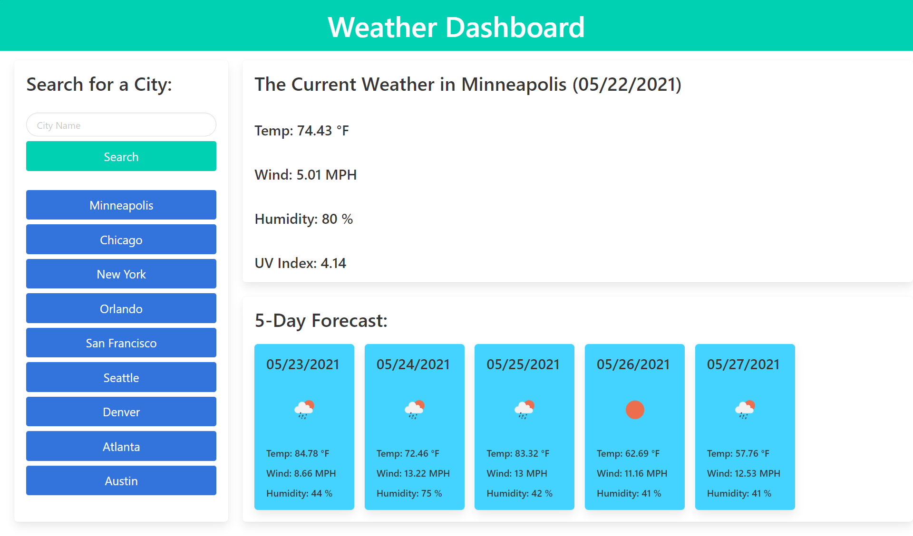

# Super_Weather_Page

## Description

    The motivation for this project was to create a web page that that will fetch you an API of a weather server and display the weather information of the current time and also a forecast of the next 5 days of the city you need. I learn that for this work you needed to apply all the knowledge of all the past clases to be apply into this work even do I went above and used some different 3rd party API to better expand my knowledge with other cooding skils. 

## Usage

    On the webpage you will see the current weather iunformation like date, temperature, wind speed, humidity and UV index (for the uv index it will display a background color indicating whether the conditions are favorable, moderate, or severe) on the top right side of the page and it will will change the information if you click for a new city it will save the new city as a button on the left side and if you click any of the buttons of the past cities on the left side, it will display the information back again. In adition to the current information it will also give you a 5 day forecast of the current display city with the temperature, wind speed and humidity.

## Links & Screenshots

 * [Super Weather Page Web Page](https://arielo5.github.io/Super_Weather_Page/)

 * Screenshots of the web pages

    
    

## Repo Content
* css (folder)
    * style.css
* images (folder)
* javascript (folder)
    * scrips.js 
* README.md
* index.html